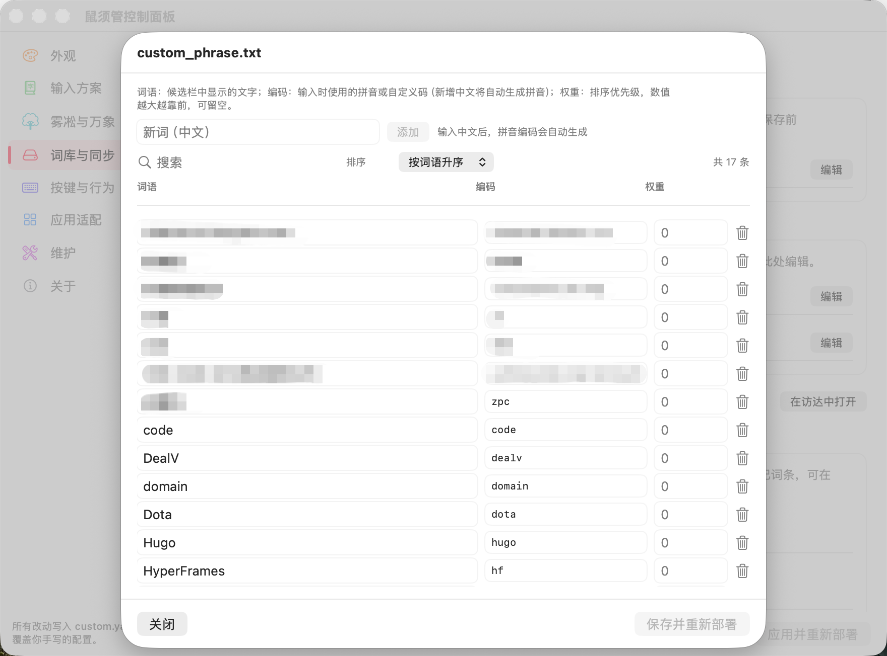
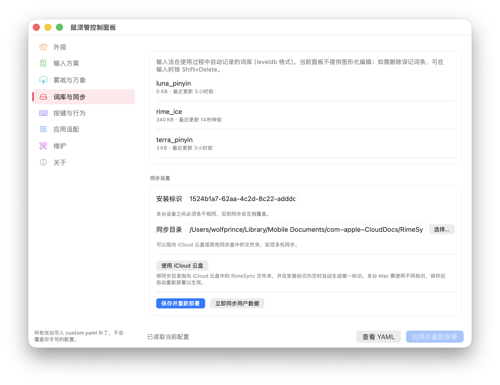
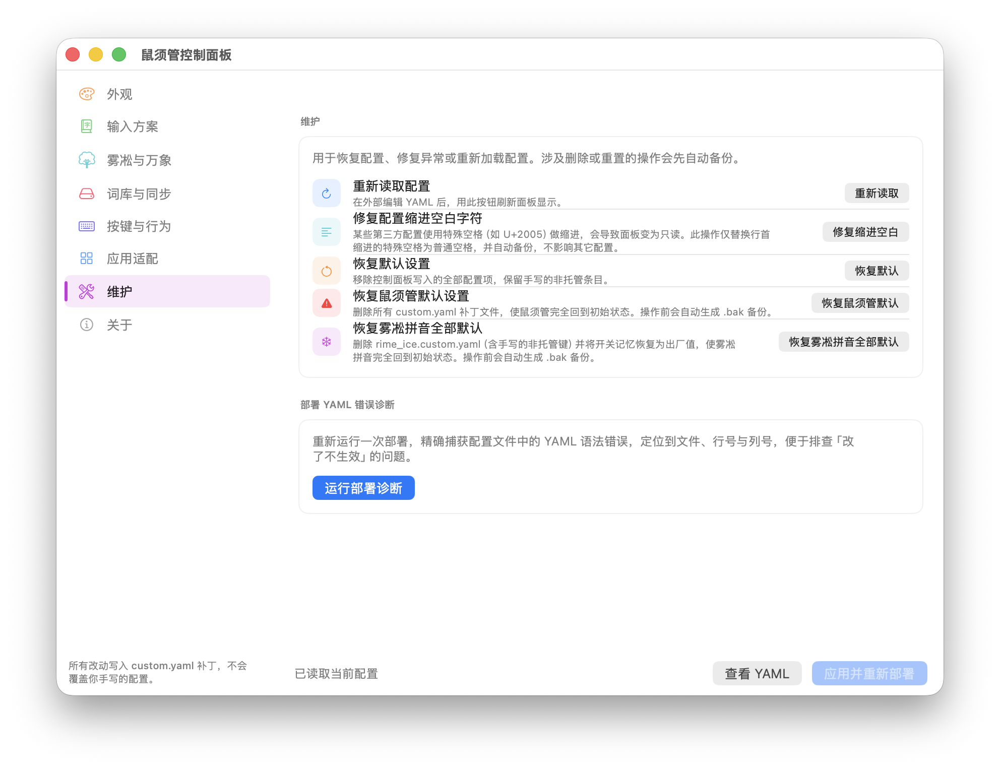

<div align="center">


# 鼠须管控制面板 · Squirrel Panel

**Squirrel Panel** —— 一个独立的、第三方的 [鼠须管（Squirrel）](https://github.com/rime/squirrel) macOS 输入法图形设置工具。

> 本项目与鼠须管输入法本体相互独立。安装本 App 后，即可在图形界面里控制自己电脑上的鼠须管，无需手动编辑 YAML；卸载本 App 也不会影响输入法本身。

---

</div>

## 最新版本

**v1.3.2 已发布** —— 专注于「词库编辑」与「同步功能」升级，并新增独立的**维护面板**，把所有维护与修复类操作集中在一处：

- **📚 词库图形化编辑**：`custom_phrase.txt` 与用户级 `*.dict.yaml` 现在可以直接在面板里增删改查。输入中文即可自动生成拼音编码，权重、搜索、排序、备份一应俱全，不再需要手写编码。
- **🌐 同步升级**：一键将同步目录指向 iCloud 云盘，并自动为 `RimeSync` 文件夹设置鼠须管控制面板图标；同步目录展示与选择器均已优化。
- **🔧 维护面板**：把「重新读取配置、修复缩进空白字符、恢复默认设置、恢复鼠须管默认、恢复雾凇默认、部署 YAML 错误诊断」全部集合在一个面板，操作前自动 `.bak` 备份。

[查看 v1.3.2 发布说明 →](https://github.com/wolfprince12/squirrel-Panel/releases/tag/v1.3.2)

**v1.3.1** 调整了更新升级策略，检查更新速度大为提升：雾凇拼音、鼠须管输入法、鼠须管控制面板三者的更新检查，现在与万象语法模型一致，走「国内镜像优先 + 轻量 HEAD 请求」链路，告别此前依赖被墙的 GitHub API 导致的 5–20 秒等待。

**v1.3.0** 是一次大版本更新：整个软件 UI 完全重构，配色方案卡片新增动态悬停效果，并在作者专属配色方案之外，新增「用户自定义配色方案」功能（可创建多套命名配色、实时预览、导入导出，并在外观面板中确认展示）。

## 功能

- **🎨 外观**：配色方案（含用户自定义配色）、字体、候选窗布局、实时预览与动态悬停效果。
- **⌨️ 输入方案**：启用/禁用/排序方案、切换快捷键（点击输入框即自动录制）、菜单标题。
- **🌳 雾凇与万象**：侧边栏专属入口，集中管理雾凇拼音与万象语法模型，无需手改 YAML。
- **📚 词库与同步**：图形化编辑用户词库；第三方词库与语法模型（如万象语法模型）一键安装/更新/卸载并自动备份；同步目录与 ID、一键同步、iCloud 云盘图标。
- **🖱️ 按键与行为**：每页候选数、Caps Lock 行为、各修饰键动作，以及 **Tab / Shift+Tab 翻页**。
- **🪟 应用适配**：按 App 设置 ASCII 模式、内联/非内联、Vim 模式。
- **🔧 维护**：集中进行重新读取配置、修复 YAML 缩进空白、恢复默认、急救重置，以及部署 YAML 错误诊断。
- **ℹ️ 关于**：运行状态、路径跳转、YAML 预览、版本更新提醒（含鼠须管本体更新检查）。

> 所有改动以 Rime 标准的 `*.custom.yaml` 补丁形式写入，不会覆盖你手写的其他配置；涉及删除或重置的操作前会自动生成 `.bak` 备份。

### 🎨 外观与配色

- 系统内置配色方案一键预览与切换，候选窗、字体、布局实时可见。
- **用户自定义配色方案**：在编辑器里创建多套命名配色（含作者、颜色空间设定），实时预览、保存、导入/导出；外观面板只展示你「确认采用」的那一套。这是多数同类面板不具备的能力。
- 配色卡片新增动态悬停效果；深色模式配色下拉分为「系统配色 / Mr大狼专属配色 / 用户自定义方案」三组，结构清晰。


### 📚 词库图形化编辑

不再需要手写编码。在「词库与同步」面板中，每个可编辑词库右侧都有「编辑」按钮，点击后在 sheet 中管理词条：

- 三列式编辑：词语、编码、权重，列宽与表头对齐；
- 新增中文词条时，拼音编码由系统自动生成；
- 支持搜索、排序（词语/编码升降序）、总条数显示；
- 保存前自动生成 `.bak` 备份，保存后自动重新部署；
- 兼容 `custom_phrase.txt` 与用户级 `*.dict.yaml`。



### 🌳 雾凇与万象

这是本面板的主打能力之一。在侧边栏点击 🌳 图标即可进入，把雾凇拼音最常见的配置收进一个页面：

- 直接安装、更新、卸载**雾凇拼音**方案；
- 一键叠加 **万象语法模型**（本地 `.gram` 语言模型），显著提升长句联想与整句准确度；
- 三态控制简繁、Emoji、中英混输等出厂开关，以及 Lua 滤镜、模糊音等高级选项。


面板分为五大区块：

- **包管理**：雾凇拼音的安装 / 更新 / 卸载，以及安装后的部署状态。
- **基础开关**：雾凇拼音出厂的多个开关（简繁、Emoji、中英混输、拆字等）支持「记忆 / 开 / 关」三态控制。
- **词库**：用户词库概览（自定义短语已合并到「词库与同步」面板统一编辑）。
- **语言与拼音**：繁体类型、双拼方案切换。
- **高级**：Lua 滤镜、模糊音等进阶选项。

> 「恢复雾凇拼音全部默认」等急救操作已移至侧边栏独立的「维护」面板，与鼠须管本身的恢复操作集中管理。

### 🌐 词库同步

- 设置安装标识与同步目录，一键同步用户数据；
- 一键将同步目录指向 iCloud 云盘的 `RimeSync` 文件夹，面板会自动为同步目录添加鼠须管控制面板图标，方便在 Finder 中识别；
- 同步目录输入框已拉长，目录选择器会打开当前同步目录。



### 🔧 维护面板

把原本分散在多个页面的修复、重置、诊断类操作集合到一处，所有涉及写盘/删除的操作都会先自动 `.bak` 备份：

- **重新读取配置**：外部编辑 YAML 后，刷新面板当前显示。
- **修复配置缩进空白字符**：将行首特殊空白（如 U+2005）替换为普通空格，解决某些第三方配置导致面板变为只读的问题。
- **恢复默认设置**：移除控制面板写入 `default.custom.yaml` 的全部托管配置项，保留手写的非托管条目。
- **恢复鼠须管默认设置**：删除所有 `*.custom.yaml` 补丁，让鼠须管完全回到初始状态。
- **恢复雾凇拼音全部默认**：删除 `rime_ice.custom.yaml`（含手写配置）并将开关记忆恢复为出厂值，让雾凇拼音完全回到初始状态。
- **部署 YAML 错误诊断**：重新运行一次部署，精确捕获 YAML 语法错误，定位到文件、行号与列号，便于排查「改了不生效」的问题。



## 下载 / 安装

1. 从 [Releases](https://github.com/wolfprince12/squirrel-Panel/releases) 下载最新的 `Squirrel-Panel-x.y.z.dmg`。
2. 打开 DMG，将 `Squirrel Panel.app` 拖入 **应用程序** 文件夹。
3. 首次运行如提示「无法打开」，请前往 **系统设置 → 隐私与安全性** 点击「仍要打开」。

> 使用前请确保你的 Mac 已安装鼠须管输入法（[官方下载](https://rime.im/download/)）。

## 语言

界面跟随系统语言，目前支持简体中文、繁体中文与英文。App 名称也会随系统语言切换：英文系统显示 **Squirrel Panel**，简体中文显示**鼠须管控制面板**，繁体中文显示**鼠鬚管控制面板**。

## 自行构建

需要 macOS 13+、Xcode 15+ / Swift 5.9+。

```bash
git clone https://github.com/wolfprince12/squirrel-Panel.git
cd squirrel-Panel
make release
# 产物：dist/Squirrel Panel.app
```

如果修改过 `Resources/AppLogo.png`，需要先重新生成图标：

```bash
make icons
```

如果终端启用了沙箱导致 SwiftPM 无法执行清单编译：

```bash
make release SWIFT_BUILD="swift build --disable-sandbox"
```

## 它是如何工作的

本 App 不链接 `librime`，也不直接操作输入法进程，而是通过三种官方/安全机制与鼠须管交互：

1. 读写 `~/Library/Rime/*.custom.yaml` 补丁文件。
2. 调用 `Squirrel.app/Contents/MacOS/Squirrel --reload / --sync / --quit` 等命令行接口。
3. 向 `SquirrelReloadNotification` 等分布式通知发送消息，触发输入法重新部署。

因此，即使本控制面板出现 bug，最多只会影响补丁文件；卸载本 App 不会影响鼠须管输入法本身。

## 项目关系

- [rime/squirrel](https://github.com/rime/squirrel) —— 鼠须管输入法本体。
- [iDvel/rime-ice](https://github.com/iDvel/rime-ice) —— 雾凇拼音（本面板已为其提供独立的 🌳 雾凇拼音控制面板）。
- [amzxyz/RIME-LMDG](https://github.com/amzxyz/RIME-LMDG) —— 万象语法模型（本地语言模型，可叠加在雾凇拼音之上显著提升长句联想与整句准确度；在本面板「词库与同步」中一键安装）。
- [wolfprince12/squirrel-Panel](https://github.com/wolfprince12/squirrel-Panel) —— 本控制面板（第三方独立项目）。

## 关于作者

**Mr大狼（Winter Zheng）** —— 二十年影视传媒老兵，做过音乐节、纪录片、综艺导演，作品上过央视春晚、北影节音乐节。八年前独立运营「大狼导演工作室」，近年转型用 AI 把跨界底子焊成产品：爻知云AI 微信服务号、DealV 智能合同平台、鼠须管输入法图形控制台等。

鼠须管是好用的输入法，但改配置要手写 YAML，对普通人门槛太高。做这个面板，就是想把它变得「看得见、点得到」。


## 赞助 · 请杯咖啡

如果这个项目帮到了你，欢迎扫微信二维码请作者一杯咖啡 ☕ —— 所有赞助都会变成更多折腾输入法的时间，继续打磨这个面板。


也可以留个 Star ⭐，这是对独立开发者最大的鼓励。

## 许可

[GNU General Public License v3.0](./LICENSE)

---

# Squirrel Panel (English)

> This English section is a translation of the Chinese section above. In case of conflict, the Chinese version prevails.

<div align="center">


**Squirrel Panel** — a standalone, third-party graphical settings app for the [Squirrel](https://github.com/rime/squirrel) Rime input method on macOS.

> This project is independent of the Squirrel input method itself. After installing this app, users can control their local Squirrel installation through a GUI, without editing YAML by hand — and uninstalling it won't affect Squirrel.

---

</div>

## Latest version

**v1.3.2 is out** — focused on dictionary editing and sync upgrades, plus a new dedicated **Maintenance** panel that centralizes all repair/reset/diagnostic actions.

- **📚 Graphical dictionary editor**: `custom_phrase.txt` and user-level `*.dict.yaml` can now be edited visually. Type Chinese and the pinyin code is generated automatically; weight, search, sort, and `.bak` backups are all included.
- **🌐 Sync upgrades**: one-click sync-directory setup in iCloud Drive, with an automatic Squirrel Panel folder icon applied to the `RimeSync` folder; the sync path field and picker are also improved.
- **🔧 Maintenance panel**: reload config, fix YAML indentation whitespace, restore defaults, reset Squirrel, reset Rime Ice, and run deploy-time YAML error diagnostics — all in one place, with automatic `.bak` backups before destructive actions.

[Release notes →](https://github.com/wolfprince12/squirrel-Panel/releases/tag/v1.3.2)

**v1.3.1** adjusted the update strategy: update checks for Rime Ice, Squirrel, and Squirrel Panel itself now use the same "mirror-first + lightweight HEAD request" path as the Wanxiang Grammar Model, doing away with the 5–20s waits caused by the blocked GitHub API.

**v1.3.0** was a major release: the entire UI was rebuilt, color-scheme cards gained a hover animation, and a new **user-custom color scheme** feature was added alongside the author's signature schemes (create multiple named schemes, live-preview, import/export, and confirm which one to show in the Appearance panel).

## Features

- **🎨 Appearance**: color schemes (including user-custom schemes), fonts, candidate window layout, live preview with hover animation.
- **⌨️ Schemas**: enable/disable/reorder schemes, switch hotkeys (click the box to capture), menu title.
- **🌳 Rime Ice & Wanxiang**: a dedicated sidebar entry to centrally manage Rime Ice and the Wanxiang grammar model, without hand-editing YAML.
- **📚 Dictionary & sync**: graphical editing of user dictionaries; third-party dictionaries and grammar models (e.g., Wanxiang Grammar Model) with one-click install/update/uninstall and automatic backup; sync dir & ID, one-click sync, and iCloud folder icon.
- **🖱️ Key behavior**: candidates per page, Caps Lock behavior, modifier-key actions, and **Tab / Shift+Tab paging**.
- **🪟 Per-app**: ASCII mode, inline/non-inline, Vim mode per application.
- **🔧 Maintenance**: reload config, fix indentation whitespace, restore defaults, reset Squirrel, reset Rime Ice, and deploy-time YAML error diagnostics.
- **ℹ️ About**: running status, path jump, YAML preview, and update checks (including Squirrel itself).

All changes are written as Rime-standard `*.custom.yaml` patches — they never overwrite your other hand-written config, and destructive operations create a `.bak` backup first.

### 🎨 Appearance & color schemes

- One-click preview and switching of built-in color schemes, with the candidate window, fonts, and layout shown live.
- **User-custom color schemes**: create multiple named schemes (with author and color-space settings) in the editor, preview them live, save, import/export; the Appearance panel shows only the scheme you "confirmed". This is something most comparable panels do not offer.
- Color-scheme cards now have a hover animation; the dark-mode scheme dropdown is grouped into "System / Mr大狼's schemes / User-custom" for a clear structure.


### 📚 Graphical dictionary editor

No more hand-writing codes. In the "Dictionary & Sync" panel, every editable dictionary has an "Edit" button that opens a sheet:

- Three-column editing: word, code, weight, with aligned headers and columns;
- Chinese words automatically get a generated pinyin code;
- Search, sort (word/code ascending/descending), and entry count;
- Automatic `.bak` backup before saving, then automatic redeploy;
- Compatible with `custom_phrase.txt` and user-level `*.dict.yaml`.


### 🌳 Rime Ice & Wanxiang

One of the panel's headline features. Click the 🌳 icon in the sidebar to open a single page for the most common Rime Ice settings:

- Install, update, and uninstall **Rime Ice** directly.
- Layer the **Wanxiang Grammar Model** (a local `.gram` language model) in one click for much better long-sentence prediction and whole-sentence accuracy.
- Toggle built-in switches (simplification/traditional, Emoji, mixed CN/EN, etc.) and access Lua filters / fuzzy pinyin options without hand-editing YAML.


The panel is organized into five sections:

- **Package**: install / update / uninstall Rime Ice, plus its deploy status.
- **Basic switches**: Rime Ice's built-in switches (simplification/traditional, Emoji, mixed CN/EN, radical, etc.) with three states — remember / on / off.
- **Lexicon**: user dictionary overview (custom phrases are now edited in the unified "Dictionary & Sync" panel).
- **Language & pinyin**: traditionalization type, double-pinyin scheme switching.
- **Advanced**: Lua filters, fuzzy pinyin and other options.

> Emergency actions like "Reset all Rime Ice configs" have moved to the dedicated **Maintenance** panel in the sidebar, alongside Squirrel's own reset actions.

### 🌐 Dictionary sync

- Set installation ID and sync directory, then sync user data in one click.
- One-click sync-directory setup in iCloud Drive's `RimeSync` folder; the panel automatically applies a Squirrel Panel folder icon so you can spot it in Finder.
- The sync path field is wider, and the directory picker now opens the current sync directory.


### 🔧 Maintenance panel

All repair, reset, and diagnostic actions are now centralized. Destructive operations create a `.bak` backup first:

- **Reload config**: refresh the panel after editing YAML externally.
- **Fix indentation whitespace**: replace special leading whitespace (e.g. U+2005) with normal spaces, fixing third-party configs that make the panel read-only.
- **Restore default settings**: remove all panel-managed entries from `default.custom.yaml`, keeping your other hand-written entries.
- **Restore Squirrel defaults**: delete all `*.custom.yaml` patches and return Squirrel to its initial state.
- **Restore Rime Ice defaults**: delete `rime_ice.custom.yaml` (including hand-written entries) and reset switch memories to factory values.
- **Deploy YAML diagnostics**: run a deploy and capture YAML syntax errors with file, line, and column information, making it easy to find why a change "didn't take effect".


## Install

1. Download the latest `Squirrel-Panel-x.y.z.dmg` from [Releases](https://github.com/wolfprince12/squirrel-Panel/releases).
2. Open the DMG and drag `Squirrel Panel.app` into **Applications**. The app name follows your system language: **Squirrel Panel** (English), **鼠须管控制面板** (Simplified Chinese), or **鼠鬚管控制面板** (Traditional Chinese).
3. If the first launch says "cannot be opened", go to **System Settings → Privacy & Security** and click "Open Anyway".

> Make sure the Squirrel input method is installed on your Mac ([official download](https://rime.im/download/)).

## How it works

This app does not link `librime` nor directly manipulate the input method process. It interacts with Squirrel through three official/safe mechanisms:

1. Reading and writing `~/Library/Rime/*.custom.yaml` patch files.
2. Invoking the `Squirrel.app/Contents/MacOS/Squirrel --reload / --sync / --quit` command-line interface.
3. Sending distributed notifications such as `SquirrelReloadNotification` to trigger redeploy.

So even if this panel has a bug, at worst it only affects the patch files; uninstalling it won't affect the Squirrel input method itself.

## Related Projects

- [rime/squirrel](https://github.com/rime/squirrel) — the Squirrel input method itself.
- [iDvel/rime-ice](https://github.com/iDvel/rime-ice) — Rime Ice (this panel provides a dedicated 🌳 Rime Ice control panel).
- [amzxyz/RIME-LMDG](https://github.com/amzxyz/RIME-LMDG) — Wanxiang Grammar Model (a local grammar model that layers on top of Rime Ice for better long-sentence prediction; installable in one click from this panel's "Dictionary & sync").
- [wolfprince12/squirrel-Panel](https://github.com/wolfprince12/squirrel-Panel) — this control panel (a third-party, independent project).

## About the Author

**Mr大狼 (Winter Zheng)** — 20+ years in film, TV and live production; runs "Big Wolf Director Studio" independently; now rebuilding cross-domain experience into AI products: 爻知云AI WeChat Official Account, DealV smart contract platform, Squirrel Panel (input-method GUI), and more.

Squirrel is a great input method, but configuring it means hand-editing YAML — too high a bar for most people. This panel exists to make it visible and clickable.


## Sponsor · Buy Me a Coffee

If this project helped you, feel free to buy me a coffee via WeChat Pay ☕


## License

[GNU General Public License v3.0](./LICENSE)
