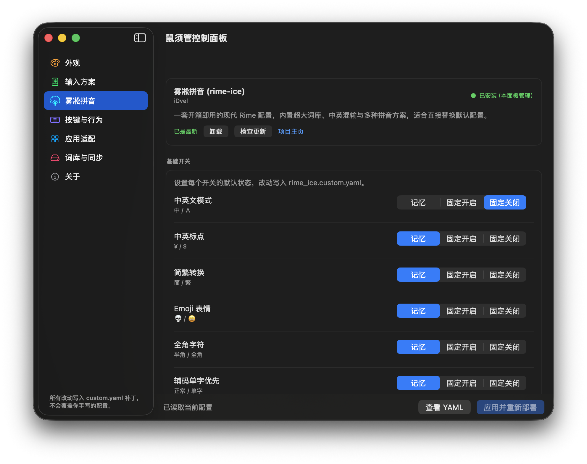

<div align="center">


# 鼠须管控制面板 · Squirrel Panel

**Squirrel Panel** —— 一个独立的、第三方的 [鼠须管（Squirrel）](https://github.com/rime/squirrel) macOS 输入法图形设置工具。

> 本项目与鼠须管输入法本体相互独立。安装本 App 后，即可在图形界面里控制自己电脑上的鼠须管，无需手动编辑 YAML；卸载本 App 也不会影响输入法本身。

---

</div>

## 最新版本

**v1.2.3 已发布** —— 修复了「配置含特殊空格（U+2005）缩进导致面板整体只读」的兼容性问题，并在关于页「维护」新增一键修复按钮；v1.2.2 起雾凇拼音已有独立控制面板。[查看发布说明 →](https://github.com/wolfprince12/squirrel-Panel/releases/tag/1.2.3)

## 功能

- **🌳 雾凇拼音独立面板**：侧边栏新增专属入口，集中控制雾凇拼音的包管理、基础开关、词库与短语、语言与拼音、高级滤镜等，无需手改 YAML。
- **🎨 外观**：配色方案、字体、候选窗布局、实时预览。
- **⌨️ 输入方案**：启用/禁用/排序方案、切换快捷键（点击输入框即自动录制）、菜单标题。
- **🖱️ 按键与行为**：每页候选数、Caps Lock 行为、各修饰键动作，以及 **Tab / Shift+Tab 翻页**。
- **🪟 应用适配**：按 App 设置 ASCII 模式、内联/非内联、Vim 模式。
- **📚 词库与同步**：第三方词库包「雾凇拼音（rime-ice）」一键安装/更新/卸载并自动备份；用户词库概览；同步目录与 ID、一键同步。
- **🔧 关于**：运行状态、路径跳转、恢复默认、YAML 预览、版本更新提醒（含鼠须管本体更新检查）。

> 所有改动以 Rime 标准的 `*.custom.yaml` 补丁形式写入，不会覆盖你手写的其他配置；应用前会自动生成 `.bak` 备份。

### 🌳 雾凇拼音独立面板

这是 v1.2.2 的主打能力。在侧边栏点击 🌳 图标即可进入，把雾凇拼音最常见的配置收进一个页面：



面板分为五大区块：

- **包管理**：雾凇拼音的安装 / 更新 / 卸载，以及安装后的部署状态。
- **基础开关**：雾凇拼音出厂的多个开关（简繁、Emoji、中英混输、拆字等）支持「记忆 / 开 / 关」三态控制。
- **词库与短语**：用户词库概览与短语编辑。
- **语言与拼音**：繁体类型、双拼方案切换。
- **高级**：Lua 滤镜、模糊音等进阶选项。

面板底部还提供「维护」区：
- **恢复雾凇默认**：仅清除本面板托管的配置项，保留你手写的其它 `rime_ice.custom.yaml` 内容，改动走「应用并重新部署」确认流程。
- **恢复雾凇拼音全部默认**（急救）：一键删除 `rime_ice.custom.yaml`（含手写配置，删前自动 `.bak` 备份）并重新部署，让雾凇拼音整体回到出厂状态——与「关于」页还原鼠须管配置同级的安全网。

## 下载 / 安装

1. 从 [Releases](https://github.com/wolfprince12/squirrel-Panel/releases) 下载最新的 `Squirrel-Panel-x.y.z.dmg`。
2. 打开 DMG，将 `Squirrel Panel.app` 拖入 **应用程序** 文件夹。
3. 首次运行如提示「无法打开」，请前往 **系统设置 → 隐私与安全性** 点击「仍要打开」。

> 使用前请确保你的 Mac 已安装鼠须管输入法（[官方下载](https://rime.im/download/)）。

## 语言

界面跟随系统语言，目前支持简体中文、繁体中文与英文。App 名称也会随系统语言切换：英文系统显示 **Squirrel Panel**，简体中文显示**鼠须管控制面板**，繁体中文显示**鼠鬚管控制面板**。

## 自行构建

需要 macOS 13+、Xcode 15+ / Swift 5.9+。

```bash
git clone https://github.com/wolfprince12/squirrel-Panel.git
cd squirrel-Panel
make release
# 产物：dist/Squirrel Panel.app
```

如果修改过 `Resources/AppLogo.png`，需要先重新生成图标：

```bash
make icons
```

如果终端启用了沙箱导致 SwiftPM 无法执行清单编译：

```bash
make release SWIFT_BUILD="swift build --disable-sandbox"
```

## 它是如何工作的

本 App 不链接 `librime`，也不直接操作输入法进程，而是通过三种官方/安全机制与鼠须管交互：

1. 读写 `~/Library/Rime/*.custom.yaml` 补丁文件。
2. 调用 `Squirrel.app/Contents/MacOS/Squirrel --reload / --sync / --quit` 等命令行接口。
3. 向 `SquirrelReloadNotification` 等分布式通知发送消息，触发输入法重新部署。

因此，即使本控制面板出现 bug，最多只会影响补丁文件；卸载本 App 不会影响鼠须管输入法本身。

## 项目关系

- [rime/squirrel](https://github.com/rime/squirrel) —— 鼠须管输入法本体。
- [iDvel/rime-ice](https://github.com/iDvel/rime-ice) —— 雾凇拼音（常用的 Rime 配置集，可在本面板「词库与同步」中一键安装）。
- [wolfprince12/squirrel-Panel](https://github.com/wolfprince12/squirrel-Panel) —— 本控制面板（第三方独立项目）。

## 关于作者

**Mr大狼（Winter Zheng）** —— 二十年影视传媒老兵，做过音乐节、纪录片、综艺导演，作品上过央视春晚、北影节音乐节。八年前独立运营「大狼导演工作室」，近年转型用 AI 把跨界底子焊成产品：爻知云AI 微信服务号、DealV 智能合同平台、鼠须管输入法图形控制台等。

鼠须管是好用的输入法，但改配置要手写 YAML，对普通人门槛太高。做这个面板，就是想把它变得「看得见、点得到」。


## 赞助 · 请杯咖啡

如果这个项目帮到了你，欢迎扫微信二维码请作者一杯咖啡 ☕ —— 所有赞助都会变成更多折腾输入法的时间，继续打磨这个面板。


也可以留个 Star ⭐，这是对独立开发者最大的鼓励。

## 许可

[GNU General Public License v3.0](./LICENSE)

---

# Squirrel Panel (English)

> This English section is a translation of the Chinese section above. In case of conflict, the Chinese version prevails.

<div align="center">


**Squirrel Panel** — a standalone, third-party graphical settings app for the [Squirrel](https://github.com/rime/squirrel) Rime input method on macOS.

> This project is independent of the Squirrel input method itself. After installing this app, users can control their local Squirrel installation through a GUI, without editing YAML by hand — and uninstalling it won't affect Squirrel.

---

</div>

## Latest version

**v1.2.3 is out** — fixes a compatibility bug where configs with special-space (U+2005) indentation made the whole panel read-only, and adds a one-click repair button under About → Maintenance; since v1.2.2 Rime Ice has its own dedicated panel. [Release notes →](https://github.com/wolfprince12/squirrel-Panel/releases/tag/1.2.3)

## Features

- **🌳 Rime Ice dedicated panel**: a new sidebar entry to centrally manage Rime Ice — package management, basic switches, lexicon & phrases, language & pinyin, advanced filters — all without hand-editing YAML.
- **🎨 Appearance**: color schemes, fonts, candidate window layout, live preview.
- **⌨️ Schemas**: enable/disable/reorder schemes, switch hotkeys (click the box to capture), menu title.
- **🖱️ Key behavior**: candidates per page, Caps Lock behavior, modifier-key actions, and **Tab / Shift+Tab paging**.
- **🪟 Per-app**: ASCII mode, inline/non-inline, Vim mode per application.
- **📚 Dictionary & sync**: third-party package **Rime Ice (雾凇拼音)** with one-click install/update/uninstall and automatic backup; user dictionary overview; sync dir & ID and one-click sync.
- **🔧 About**: running status, path jump, restore defaults, YAML preview, and update checks (including Squirrel itself).

All changes are written as Rime-standard `*.custom.yaml` patches — they never overwrite your other hand-written config, and a `.bak` backup is created automatically before applying.

### 🌳 Rime Ice dedicated panel

The headline feature of v1.2.2. Click the 🌳 icon in the sidebar to open a single page for the most common Rime Ice settings:


The panel is organized into five sections:

- **Package**: install / update / uninstall Rime Ice, plus its deploy status.
- **Basic switches**: Rime Ice's built-in switches (simplification/traditional, Emoji, mixed CN/EN, radical, etc.) with three states — remember / on / off.
- **Lexicon & phrases**: user dictionary overview and phrase editing.
- **Language & pinyin**: traditionalization type, double-pinyin scheme switching.
- **Advanced**: Lua filters, fuzzy pinyin and other options.

At the bottom there is a **Maintenance** area:
- **Reset Rime Ice defaults**: clears only the config items managed by this panel, keeping your other hand-written `rime_ice.custom.yaml` content; changes go through the "Apply & redeploy" confirmation flow.
- **Reset all Rime Ice configs** (emergency): one click deletes `rime_ice.custom.yaml` (including hand-written config, auto-backed up as `.bak` first) and redeploys, returning Rime Ice to factory state — a safety net on par with the "restore Squirrel defaults" action on the About page.

## Install

1. Download the latest `Squirrel-Panel-x.y.z.dmg` from [Releases](https://github.com/wolfprince12/squirrel-Panel/releases).
2. Open the DMG and drag `Squirrel Panel.app` into **Applications**. The app name follows your system language: **Squirrel Panel** (English), **鼠须管控制面板** (Simplified Chinese), or **鼠鬚管控制面板** (Traditional Chinese).
3. If the first launch says "cannot be opened", go to **System Settings → Privacy & Security** and click "Open Anyway".

> Make sure the Squirrel input method is installed on your Mac ([official download](https://rime.im/download/)).

## How it works

This app does not link `librime` nor directly manipulate the input method process. It interacts with Squirrel through three official/safe mechanisms:

1. Reading and writing `~/Library/Rime/*.custom.yaml` patch files.
2. Invoking the `Squirrel.app/Contents/MacOS/Squirrel --reload / --sync / --quit` command-line interface.
3. Sending distributed notifications such as `SquirrelReloadNotification` to trigger redeploy.

So even if this panel has a bug, at worst it only affects the patch files; uninstalling it won't affect the Squirrel input method itself.

## Related Projects

- [rime/squirrel](https://github.com/rime/squirrel) — the Squirrel input method itself.
- [iDvel/rime-ice](https://github.com/iDvel/rime-ice) — Rime Ice (a popular Rime configuration set, installable in one click from this panel's "Dictionary & sync").
- [wolfprince12/squirrel-Panel](https://github.com/wolfprince12/squirrel-Panel) — this control panel (a third-party, independent project).

## About the Author

**Mr大狼 (Winter Zheng)** — 20+ years in film, TV and live production; runs "Big Wolf Director Studio" independently; now rebuilding cross-domain experience into AI products: 爻知云AI WeChat Official Account, DealV smart contract platform, Squirrel Panel (input-method GUI), and more.

Squirrel is a great input method, but configuring it means hand-editing YAML — too high a bar for most people. This panel exists to make it visible and clickable.


## Sponsor · Buy Me a Coffee

If this project helped you, feel free to buy me a coffee via WeChat Pay ☕


## License

[GNU General Public License v3.0](./LICENSE)
